# Connecting a NodeMCU ESP8266 to TheMealDB API and creating our own visual timer

In this manual I will show you how you can connect your NodeMCU ESP8266
to TheMealDB API. The ESP8266 will extract a recipe from the API and
show it to you in the serial monitor in Arduino. After that you can use
a button to set a timer for when you are following a recipe, the
ledstrip will be a visual indicator as to how close the timer is to
finishing.

## Requirements:

### Hardware

- NodeMCU ESP8266

- USB cable

- Ledstrip

- Button

- 6x small cables (to connect the button and ledstrip to the esp8266)

- MacBook or Windows laptop

- Wi-Fi connection

### Software

- Arduino IDE

- ESP8266 board package

- ArduinoJson library

- Adafruit Neopixel library

### Online services

- TheMealDB API

- Web browser

## Steps:

1.  Prepare Arduino IDE

2.  Connect the NodeMCU ESP8266

3.  Connect the NodeMCU to WiFi

4.  Test the TheMealDB API

5.  Connect the NodeMCU to the API

6.  Connecting the button to the ESP8266

7.  Testing the button

8.  Connecting the ledstrip to the ESP8266

9.  Testing the ledstrip

10. Combining the button and the ledstrip with the API

## Step 1: Prepare Arduino IDE

To prepare Arduino IDE so your ESP8266 can connect with it, we have to
do a few things.

First we install the ESP8266 board package. To do this go to: File →
Preferences

At the bottom add this URL:
https://arduino.esp8266.com/stable/package_esp8266com_index.json

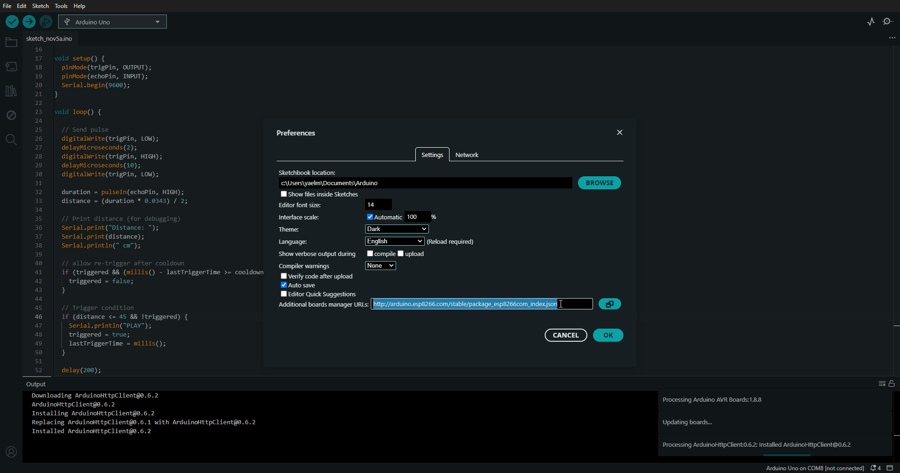

Then go to: Tools → board → board manager.

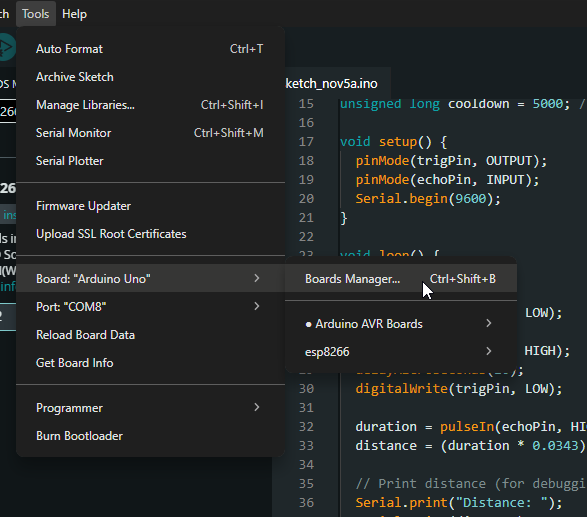

Search for: esp8266 by ESP8266 Community and install the board package.

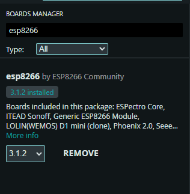

Now we are going to install ArduinoJSON. To do this go to: Sketch →
Include library → manage libraries.

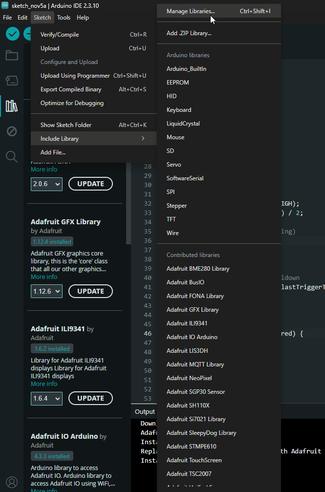

Then search for: ArduinoJson by Benoit Blanchon. Install the library

We also need to download the Adafruit Neopixel by Adafruit library. We
are going to need this one for the ledstrip. So use the same steps as
for the ArduinoJson library, but search for the Adafruit Neopixel
library.

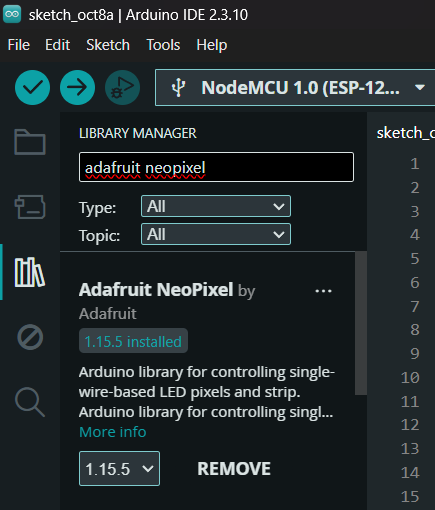 

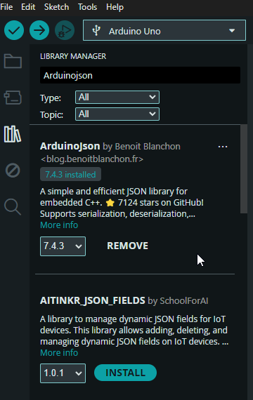

This was it for step 1


## Step 2: Connect the NodeMCU ESP8266

Connect your NodeMCU ESP8266 to you laptop or computer with a USB cable.

Then open Arduino IDE and select your board. Go to: Tools → Board →
esp8266 → NodeMCU 1.0 (ESP-12E MODULE)


Now we are going to select the correct port. Select the COM port that 
appears when you plug in the esp8266.

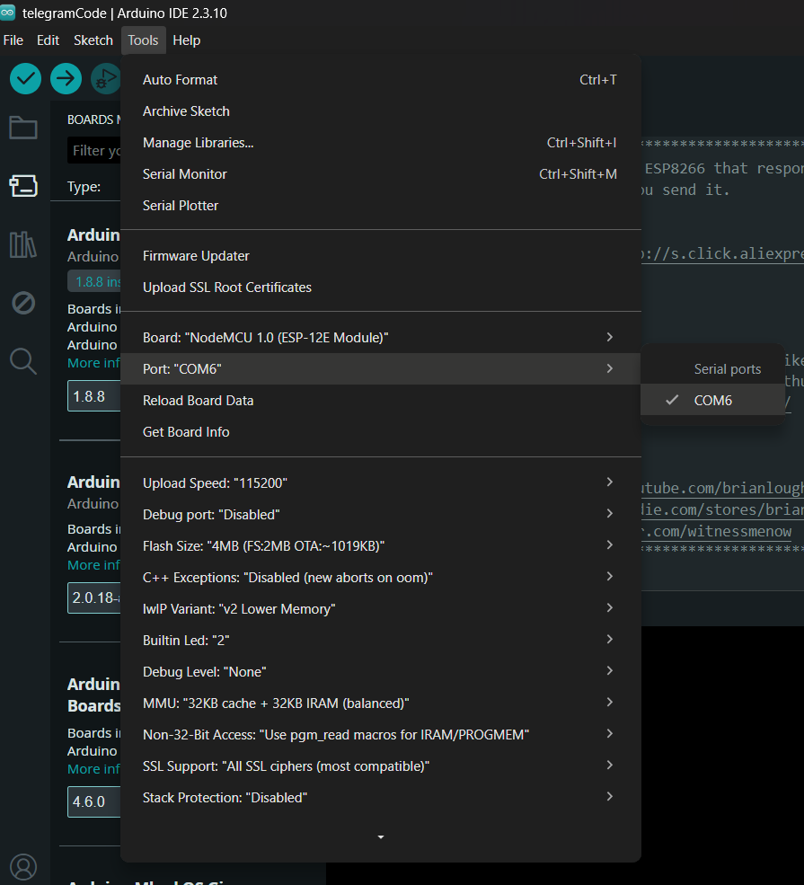

This is all for step 2.


## Step 3: Connect the NodeMCU to WiFi

In Arduino go to: File → Examples → ESP8266WiFi → WiFiClient. This will
open another sketch in Arduino. With this sketch you can test if you
esp8266 can connect with the internet.

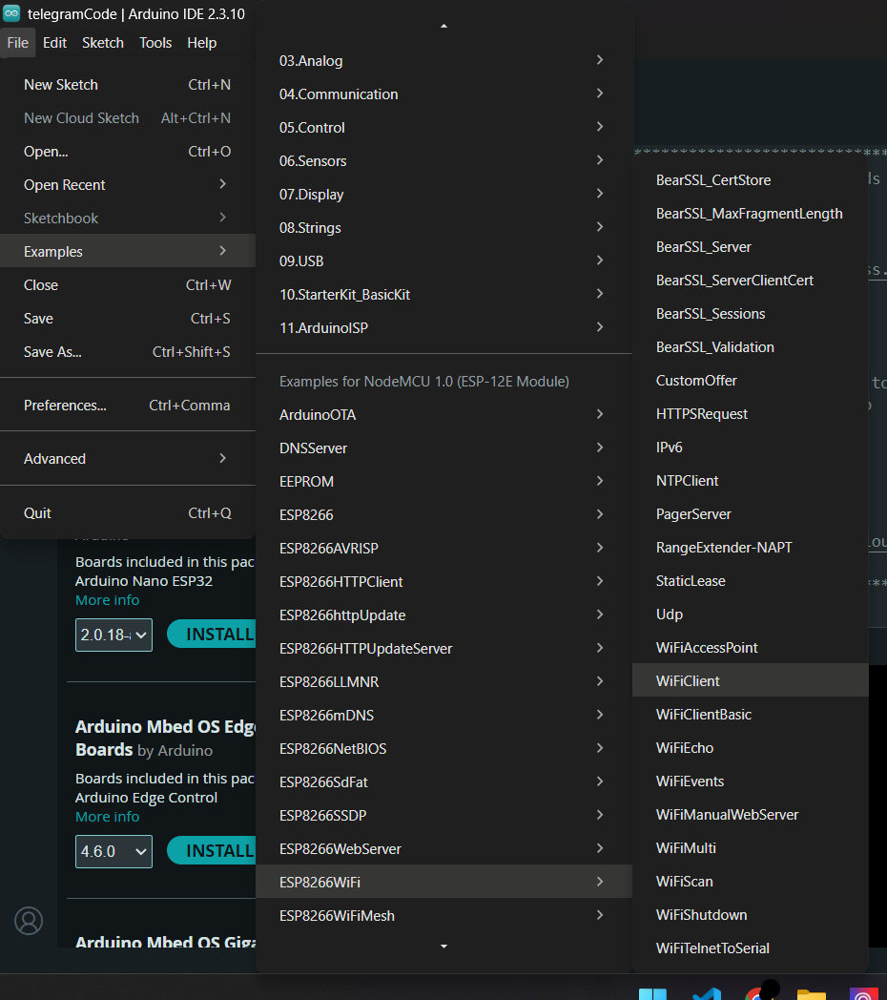

After the sketch has opened you will see a lot of code. What you want to
look for are the 2 lines where you can fill in your own WiFi network
information.

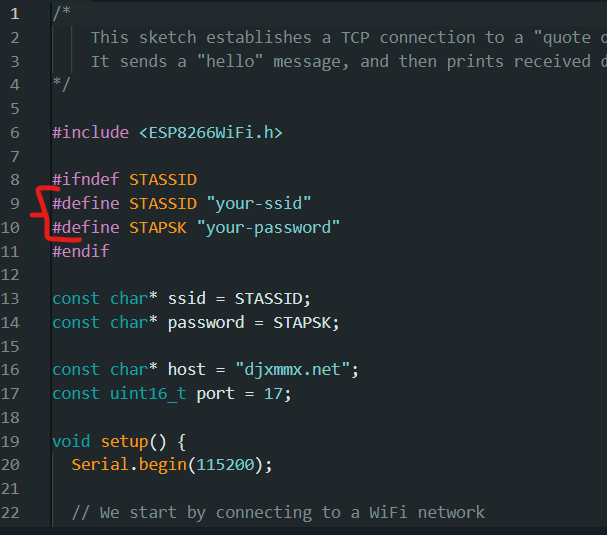

Replace your-ssid with the name of your wifi network and replace
your-password with your wifi password. Remember to keep the quotes
around the name and password.

When you have done this you can verify and upload the sketch. Do this by
clicking the checkmark at the top left and after that the arrow pointing
to the right.

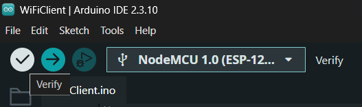

First verify

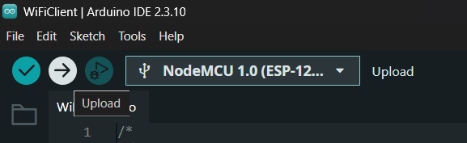

Then upload

Then you can open the serial monitor. Click the magnifying glass icon at
the top right of your
screen.

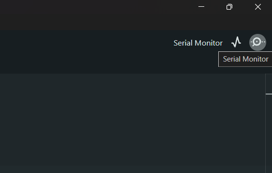

If everything worked you should see this in the Serial Monitor:

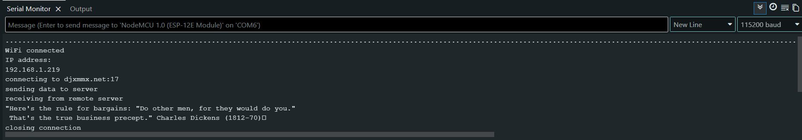

**MAKE SURE** the baud of the serial monitor (top right on the image
above) is the same as the baud in the code. Set both to 115200 baud.

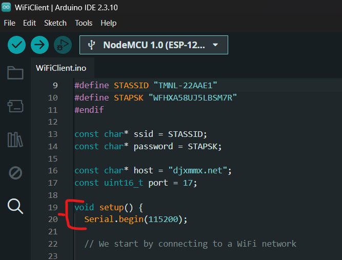

You can find it at line 20 in the code.

If everything works you can proceed to step 4.


## Step 4: Test the TheMealDB API

With step 4 we are checking to see if the API works. Paste this URL in
your web browser:


We will check to see if the API can show us the recipe for arrabiata.

If it works you will see something like this:

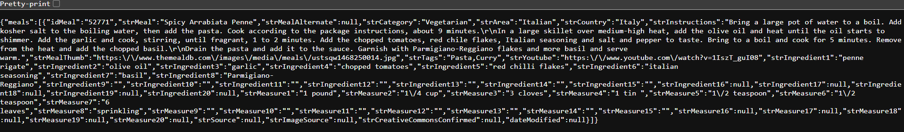

The API gives back data in JSON format, which we can later call back on
in Arduino.

This was it for step 4


## Step 5: Connect the NodeMCU to the API

Copy this code and place it in your sketch (write over the WiFi test
sketch, or create a new one):
```cp
\#include \<ESP8266WiFi.h\>

\#include \<ESP8266HTTPClient.h\>

\#include \<WiFiClientSecure.h\>

const char\* ssid = "YOUR_WIFI_NAME";

const char\* password = "YOUR_WIFI_PASSWORD";

const char\* apiUrl =

"https://www.themealdb.com/api/json/v1/1/search.php?s=Arrabiata";

void setup() {

Serial.begin(115200);

WiFi.begin(ssid, password);

Serial.print("Connecting to WiFi");

while (WiFi.status() != WL_CONNECTED) {

delay(500);

Serial.print(".");

}

Serial.println();

Serial.println("WiFi connected!");

WiFiClientSecure client;

client.setInsecure();

HTTPClient http;

Serial.println("Connecting to TheMealDB...");

if (http.begin(client, apiUrl)) {

int httpCode = http.GET();

Serial.print("HTTP code: ");

Serial.println(httpCode);

if (httpCode \> 0) {

String response = http.getString();

Serial.println("API response:");

Serial.println(response);

}

http.end();

}

}

void loop() {

}
```
Remember to change the SSID and the password to those of your network
and check if the baud from the serial monitor is the same as in the
code.

Verify and compile the sketch, just like how we did when we checked to
see if the WiFi worked.

If everything went well you should see something like this:

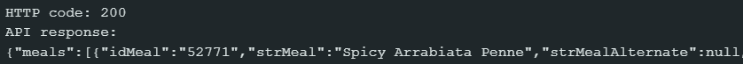

This means the esp8266 connected with the API and the API gave data
back.


## Step 6: Connecting the button to the ESP8266

To connect the button to the esp8266 you will need 3 small cables. First
connect one end of the cables to the 3 pins on the button. Look at the
small text next to the 3 pins on the button. These are really important,
because the cables need to be connected to the right pins on the
esp8266.

The pins on the buttons are labelled: GND (Ground), VCC (Power), OUT

The GND pin on the button should be connected to a G or GND pin on the
esp8266.

The VCC pin on the button should be connected to a 3V pin on the
esp8266.

The OUT pin on the button should be connected to the D1 pin on the
esp8266.

## Step 7: Testing the button

To test if the button works you will need to open a new sketch. When in
Arduino press ctrl + n, this automatically opens a new sketch. In the
sketch past this code:  
  
const int buttonPin = D1;

void setup() {

Serial.begin(115200);

pinMode(buttonPin, INPUT);

Serial.println("Button test started");

}

void loop() {

int buttonState = digitalRead(buttonPin);

Serial.println(buttonState);

delay(300);

}

Verify and upload this sketch.

If everything works you should see this in the serial monitor:

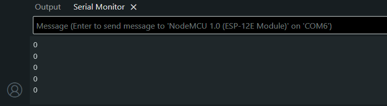

A lot of zeroes, new ones being added in set intervals of 0.3 seconds.
When you press the button it should turn one zero into a “1”, like this:

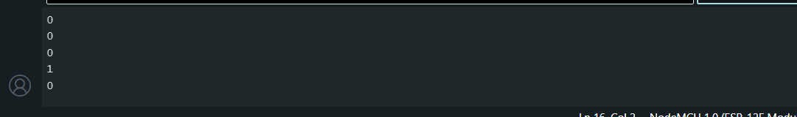

If you see this it means the button works and is connected correctly.  
  
If you don’t see it then you need to look at the cables and if they are
connected to the board and the button in the right way.


## Step 8: Connecting the ledstrip to the ESP8266

To connect the ledstrip to our board we need to use the other 3 cables
with our ledstrip. On the ledstrip the pins where the cables go on are
also labelled, but a little different than the button. On the ledstrip
you have: +5V (power), Din and GND.

The +5V cable needs to go in the 3V pin on the esp8266 (don’t make the
mistake to put it on the 3V pin).

The Din cable should go on the D2 pin on the esp8266.

The GND cable should go on a G pin on the esp8266.

## Step 9: Testing the ledstrip

To test the ledstrip create a new sketch (ctrl + n) or write over the
button testing sketch, since we won’t need that one anymore (unless your
button didn’t work!). Paste the following code in you Arduino:

\#include \<Adafruit_NeoPixel.h\>

\#define LED_PIN D2

\#define LED_COUNT 12

Adafruit_NeoPixel strip(LED_COUNT, LED_PIN, NEO_GRB + NEO_KHZ800);

void setup() {

strip.begin();

strip.setBrightness(30);

strip.show();

for (int i = 0; i \< LED_COUNT; i++) {

strip.setPixelColor(i, strip.Color(255, 100, 0));

}

strip.show();

}

void loop() {

}

Make sure to check the amount of leds on the strip, if you have 10 leds
fill in 10, and change the LED_PIN to D2

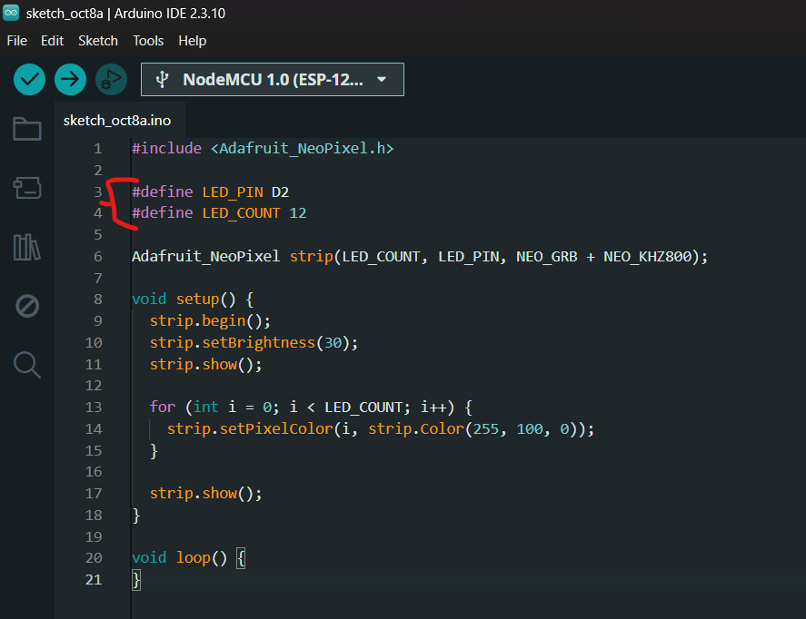

If everything is correct, verify and upload the file.

If the ledstrip turns on and shows yellow lights, it means you can go to
the next step.


## Step 10: Combining the button and the ledstrip with the API

To combine all our hardware with the API we are going to paste code in a
new sketch. What we will do now is make it so that when you press the
button for the first time the esp8266 will call the API and ask for a
recipe of arrabiata. After this when you press the button again it will
start a 15 second timer, as if you are cooking the pasta, the led strip
will change depending on how much time is left. This is a small
prototype to show how the esp8266, a button, a ledstrip, and an API can
work together on your laptop.

Copy this code and paste it in an Arduino sketch:

\#include \<ESP8266WiFi.h\>

\#include \<ESP8266HTTPClient.h\>

\#include \<WiFiClientSecure.h\>

\#include \<Adafruit_NeoPixel.h\>

\#include \<ArduinoJson.h\>

// -------------------- WiFi --------------------

const char\* ssid = "YOUR_WIFI_NAME";

const char\* password = "YOUR_WIFI_PASSWORD";

const char\* apiUrl =

"https://www.themealdb.com/api/json/v1/1/search.php?s=Arrabiata";

// -------------------- Button --------------------

\#define BUTTON_PIN D1

// Change this to LOW if your button gave LOW when pressed

\#define BUTTON_PRESSED_STATE HIGH

bool lastButtonState = !BUTTON_PRESSED_STATE;

// -------------------- LED Strip --------------------

\#define LED_PIN D2

\#define LED_COUNT 12

Adafruit_NeoPixel strip(

LED_COUNT,

LED_PIN,

NEO_GRB + NEO_KHZ800

);

// -------------------- SmartOven states --------------------

bool recipeReceived = false;

bool timerRunning = false;

bool timerFinished = false;

unsigned long timerStart = 0;

const unsigned long timerDuration = 15000; // 15 seconds

int previousSecond = -1;

// Flashing red

unsigned long previousFlash = 0;

bool flashState = false;

// ============================================================

// SETUP

// ============================================================

void setup() {

Serial.begin(115200);

pinMode(BUTTON_PIN, INPUT);

strip.begin();

strip.setBrightness(30);

strip.show();

connectWiFi();

Serial.println();

Serial.println("SmartOven ready.");

Serial.println("Press the button to request a recipe.");

}

// ============================================================

// LOOP

// ============================================================

void loop() {

checkButton();

if (timerRunning) {

updateTimer();

}

if (timerFinished) {

flashRed();

}

}

// ============================================================

// WIFI

// ============================================================

void connectWiFi() {

Serial.print("Connecting to WiFi");

WiFi.begin(ssid, password);

while (WiFi.status() != WL_CONNECTED) {

delay(500);

Serial.print(".");

}

Serial.println();

Serial.println("WiFi connected!");

Serial.print("IP address: ");

Serial.println(WiFi.localIP());

}

// ============================================================

// BUTTON

// ============================================================

void checkButton() {

bool currentButtonState = digitalRead(BUTTON_PIN);

// Detect a new button press

if (

currentButtonState == BUTTON_PRESSED_STATE &&

lastButtonState != BUTTON_PRESSED_STATE

) {

delay(50); // simple debounce

if (!recipeReceived) {

getRecipe();

} else if (!timerRunning && !timerFinished) {

startTimer();

}

}

lastButtonState = currentButtonState;

}

// ============================================================

// API

// ============================================================

void getRecipe() {

Serial.println();

Serial.println("Button pressed.");

Serial.println("Requesting recipe from TheMealDB...");

WiFiClientSecure client;

client.setInsecure();

HTTPClient http;

if (http.begin(client, apiUrl)) {

int httpCode = http.GET();

Serial.print("HTTP code: ");

Serial.println(httpCode);

if (httpCode == 200) {

String response = http.getString();

JsonDocument doc;

DeserializationError error =

deserializeJson(doc, response);

if (!error) {

const char\* mealName =

doc\["meals"\]\[0\]\["strMeal"\];

Serial.println();

Serial.println("Recipe received!");

Serial.print("Recipe: ");

Serial.println(mealName);

recipeReceived = true;

Serial.println();

Serial.println(

"Press the button again to start the 15 second timer."

);

} else {

Serial.println("Could not read JSON data.");

}

} else {

Serial.println("API request failed.");

}

http.end();

}

}

// ============================================================

// TIMER

// ============================================================

void startTimer() {

timerRunning = true;

timerStart = millis();

previousSecond = -1;

Serial.println();

Serial.println("Timer started!");

}

// ============================================================

// UPDATE TIMER

// ============================================================

void updateTimer() {

unsigned long elapsed = millis() - timerStart;

int remaining =

15 - (elapsed / 1000);

if (remaining \<= 0) {

timerRunning = false;

timerFinished = true;

Serial.println();

Serial.println("Timer finished!");

Serial.println("Your food is ready!");

return;

}

// Only print when the displayed second changes

if (remaining != previousSecond) {

previousSecond = remaining;

Serial.print("Time remaining: ");

Serial.print(remaining);

Serial.println(" seconds");

// 15 - 10 seconds = GREEN

if (remaining \>= 10) {

setStripColor(0, 255, 0);

}

// 9 - 6 seconds = YELLOW

else if (remaining \>= 6) {

setStripColor(255, 150, 0);

}

// 5 - 1 seconds = RED

else {

setStripColor(255, 0, 0);

}

}

}

// ============================================================

// FLASH RED

// ============================================================

void flashRed() {

if (millis() - previousFlash \>= 500) {

previousFlash = millis();

flashState = !flashState;

if (flashState) {

setStripColor(255, 0, 0);

} else {

setStripColor(0, 0, 0);

}

}

}

// ============================================================

// LED COLOR

// ============================================================

void setStripColor(int red, int green, int blue) {

for (int i = 0; i \< LED_COUNT; i++) {

strip.setPixelColor(

i,

strip.Color(red, green, blue)

);

}

strip.show();

}

Make sure you filled in your wifi network information and checked the
pins of both the button and the ledstrip, also check the baud of the
serial monitor.

Verify and upload the sketch, so we can see if it works.

In the serial monitor you will see lots of dots appearing:


Press the button and see if you get a message saying it is requesting a
recipe from the API.

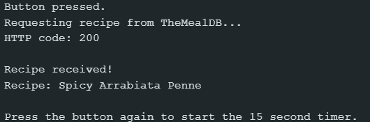

Press the button again to check if the timer works. If the color changes
every couple of seconds and when the timer is over the ledstrip flashes
red, it means your prototype works!


